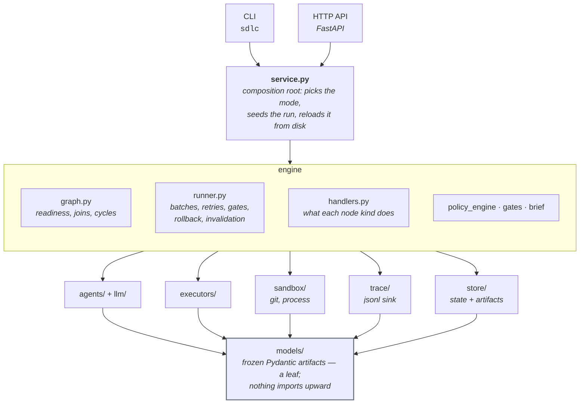
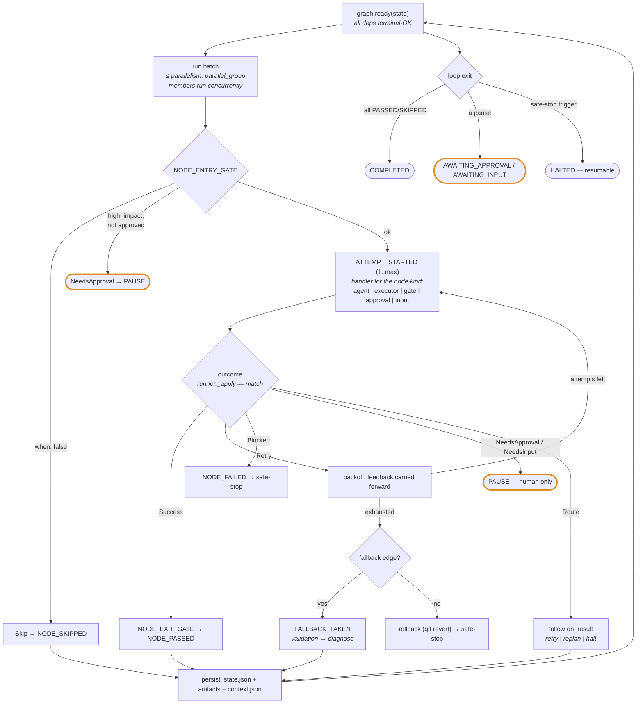
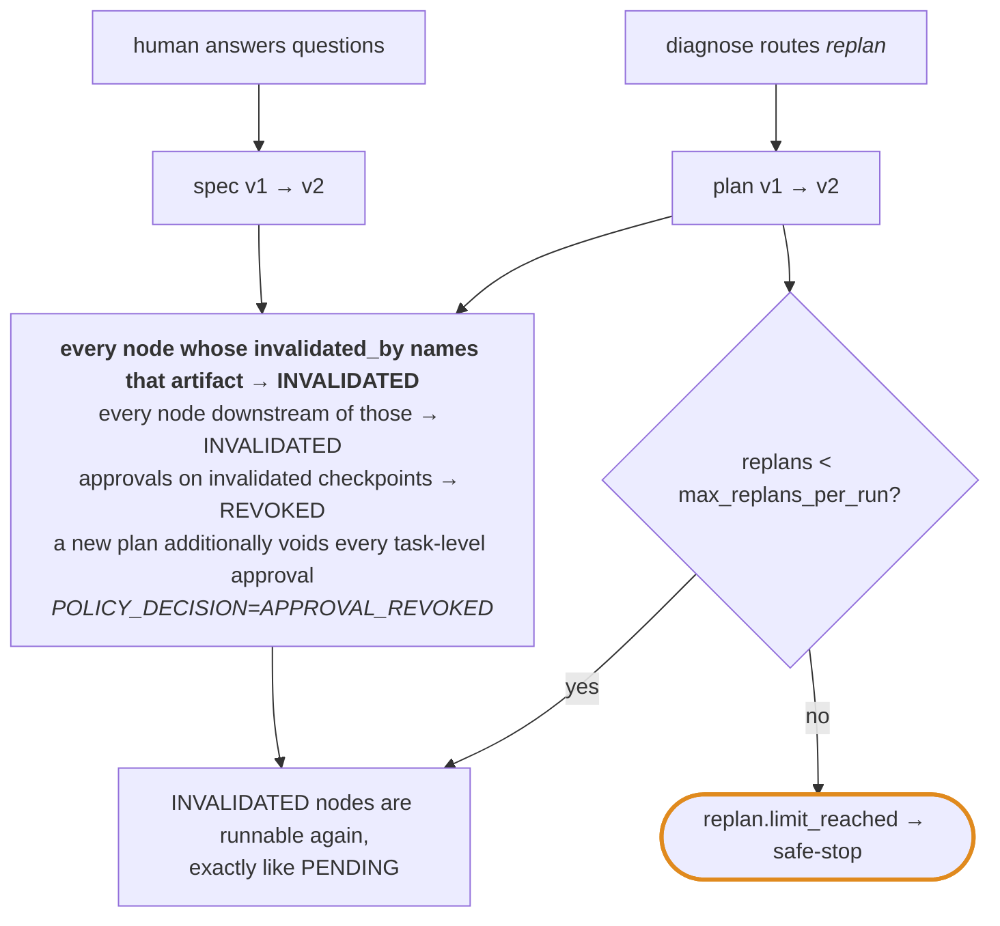
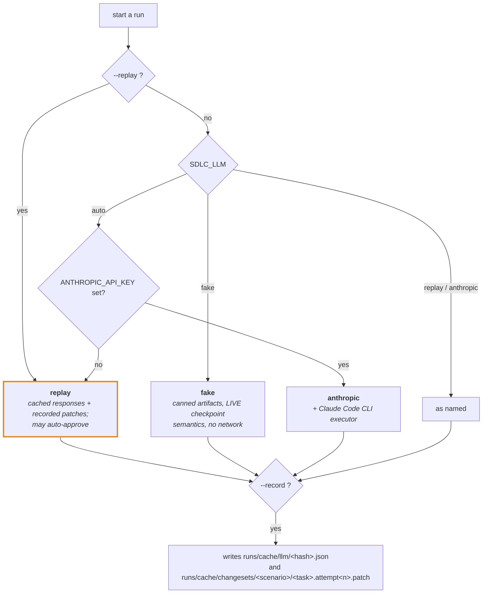

# Architecture — agentic SDLC orchestrator

> Agents propose; gates verify; humans approve. The orchestrator is a governed DAG loaded from YAML, the specs are
> typed contracts, and every metric is a query over the audit log.

**How to read this.** Start with [`design.md`](design.md) that gives overview of the problem, the flow, the four contracts.
This document is the engineering reference: what each component does, how a node actually executes, what the gate
pipeline and invalidation do, why each decision was taken over its alternatives, and what the first live run broke.
To run any of it, see [`running.md`](running.md).

---

## System map

- **Dependency direction**: `api → service → engine → {agents, executors, sandbox, trace, store}`; `models` is a leaf.
- **State on disk**: `runs/<id>/{state.json, artifacts/<name>.v<n>.json, trace.jsonl, approvals.jsonl, context.json,
  sandbox/ (git), rejected/}`.
- **Configuration**: `workflow.yaml` (the graph) · `policy.yaml` (the law) · `prompts/*.md` (one per agent).

---

## Components

**Orchestration core** — turns the YAML graph into execution.

| Component | Responsibility | Where |
|---|---|---|
| Graph | Explicit DAG from `workflow.yaml`: nodes, edges, parallel groups, fallbacks, invalidation rules; readiness; cycle check | `engine/graph.py` |
| Runner | Execution: parallel batches on asyncio with join semantics, entry/exit gates, bounded retries with structured feedback, fallback, rollback, safe-stop, re-planning by invalidation | `engine/runner.py` |
| Handlers | What each node kind does: agent / executor (task-level DAG; a HIGH task pauses the node, approving the node approves that task and the high-impact actions of the protected paths it touches; a task that reports BLOCKED naming files outside its allowed_files pauses for a `task.scope_change` approval and re-runs with exactly those files granted; retries are per task and a task that exhausts them safe-stops the node; group members run one at a time in the shared tree) / gate (result stored once under `produces`, pass or fail) / input | `engine/handlers.py` |
| Context | Versioned artifacts + lineage, feedback, answers, approvals (node ids, `task:<id>` tokens and the high-impact action names a task approval mapped onto) | `engine/context.py` |
| State | `RunState` persisted on every transition | `models/state.py`, `store/` |

**Intelligence and execution** — what produces artifacts and code.

| Component | Responsibility | Where |
|---|---|---|
| Agents | Requirements, planner, architecture, impact, security, risk, reviewer, diagnoser, documenter — prompt + schema. Every output field is fully typed: structured outputs cannot express free-form maps (the SDK transforms `dict` into an empty object, which is how the first live Design came back with no response codes), and a test asserts no agent schema degrades that way | `agents/`, `prompts/` |
| LLM client | One `structured()` call shape, four backings: `anthropic` (structured outputs via `messages.parse`: the API constrains the reply to the Pydantic JSON schema, a repair loop feeds validation errors back), `replay` (cached responses, replay semantics), `fake` (canned artifacts per schema, live semantics, no network), `recording` (any backing + cache write; `--record` records both agents and executor patches, live or fake; an exact cache hit that still validates is reused instead of a live call, so re-recording after a prompt or schema change only pays for what changed). Cache keys hash the schema, system prompt and the prompt with run ids, commit shas and numbers normalised out (they differ between a record run and its replay); on a residual miss the replay client falls back to the single recorded response for that schema. Chosen by `--replay`, then `SDLC_LLM`, then key presence | `llm/`, `service.py#_mode` |
| Executors | Claude Code CLI (primary), replay (recorded patches), recording (wraps any executor and writes `runs/cache/changesets/<scenario>/<task>.attempt<n>.patch` after each task; `--record`), fake (`SDLC_LLM=fake`: trivial module + unit test per task, release artifacts from the Design when the task allows them; python stack only). The fake executor plants a failure: attempt 1 also writes `.env`, a forbidden path, so every fake run shows `POLICY_DECISION=VIOLATION` -> task commit reverted (`ROLLED_BACK`) -> attempt 2 clean, caught by the policy engine, not the executor | `executors/` |
| Repo map | Brownfield intake: when `SDLC_WORKSPACE` exists it is copied into the run's sandbox and committed as the baseline; `build_repo_map` (ast for python, regex for java) puts packages, import edges, endpoints and tables into context as `repo_map`, which the impact agent reads instead of the raw tree | `sandbox/repo_map.py`, `service.py#_seed` |

**Governance and evidence** — what constrains the work and records it.

| Component | Responsibility | Where |
|---|---|---|
| Policy engine | Change control (allowed/protected/forbidden), scope + size limits, secret/banned-pattern/PII scan, command allowlist. Enforced twice: at the write boundary (every task's files, right after it commits: scope + scan -> `POLICY_DECISION`, revert + `ROLLED_BACK` + structured feedback on a violation) and by the run-level `scope`/`security` gates, which diff the whole run against the `sdlc/base` tag | `engine/policy_engine.py`, `engine/handlers.py` |
| Gates | Ordered validation: scope → compile → style → security → architecture → unit → integration → contract → acceptance(advisory) → release. `contract` diffs the committed OpenAPI document (else `Design.api`) against what the code exposes (python: `app.openapi()` dumped inside the sandbox; java: the springdoc dump under `target/`); removed operations/status codes are breaking and need `api.contract.breaking_change`, undocumented ones must be committed. `architecture` (python) runs `tests/test_architecture.py`, which the orchestrator generates and commits from `Design.classes.layering_rules` as import-linter layer contracts before the executor runs | `engine/gates.py`, `engine/arch_contract.py`, `policy.yaml#gates` |
| Approval brief | Built at every approval pause (`engine/brief.py`) and stored as the `approval_brief` artifact + `APPROVAL_REQUESTED` payload: design (endpoints, tables, packages, layering, decisions), plan (tasks, HIGH tasks, protected paths, anything outside policy), security findings, risks, cost so far from the trace, and for brownfield the contract/structure diff against `repo_map` (endpoints added/restated/removed, tables and packages added). The human decides on the proposal, never on a truncated dump | `engine/brief.py` |
| Trace | Append-only events (jsonl, memory; Postgres/Kafka in TASKS) | `trace/` |
| Metrics | Derived from events only | `trace/metrics.py`, `sql/views.sql` |
| API/CLI | `/runs`, `/approvals`, `/rejections`, `/answers`, `/metrics`, `/trace`, `/artifacts`, `/workflow/mermaid`; `GET /runs/{id}/approvals/{node}` and `sdlc brief` return the pending approval brief, and every run/approve/answer reply carries it | `api/`, `cli.py` |

---

## Orchestration model

```mermaid
flowchart TD
    REQ["requirement"] --> CLR["clarify<br/><i>input</i>"]
    CLR --> PLN["planning"]
    PLN --> ARCH["architecture"]
    PLN --> IMP["impact<br/><i>brownfield</i>"]
    ARCH --> SEC["security_review"]
    ARCH --> RSK["risk_analysis"]
    IMP --> RSK
    SEC --> AD
    RSK --> AD
    AD{{"&#9733; approval_design"}}
    AD --> IMPL["implementation<br/><i>tasks: deps + parallel groups;<br/>&#9733; HIGH tasks pause</i>"]
    IMPL --> UT["unit_tests<br/><i>unit_result</i>"]
    IMPL --> CR["code_review<br/><i>advisory</i>"]
    IMPL --> IT["integration_tests<br/><i>integration_result</i>"]
    UT --> VAL
    CR --> VAL
    IT --> VAL
    VAL{"validation<br/><i>rolls_up both results<br/>+ acceptance review</i>"}
    VAL -- pass --> DOC["documentation"] --> RR["release_readiness"] --> AR{{"&#9733; approval_release"}}
    VAL -- fail --> DIA["diagnose"]
    DIA -- retry --> IMPL
    DIA -- "replan (bounded)" --> PLN
    DIA -- halt --> HALT(["safe-stop"])
    classDef human stroke:#e08a1e,stroke-width:3px
    class AD,AR,CLR human
```

- `unit_tests` and `integration_tests` record their results (`unit_result`, `integration_result`) and PASS.
  `validation` `rolls_up` both plus the advisory acceptance review into the verdict (`validation_result`) and is the
  only node that fails into `diagnose`.
- An invalidated approval node needs a fresh approval; a new plan voids task-level approvals
  (`POLICY_DECISION=APPROVAL_REVOKED`), so a re-planned design is never released on a stale approval.
- **brownfield** adds `planning -> impact -> {architecture, risk_analysis}`; two HIGH tasks (migration, dependency)
  each pause implementation, and the compliance scan catches a persisted raw IP on attempt 1.
- **ambiguous** (`SDLC_LLM=fake`) pauses on 6 questions; `sdlc answer` yields spec v2; a planted failing test drives
  diagnose -> replan until `max_replans_per_run` trips `replan.limit_reached`.

What the graph buys, in one list each:

- **Non-linear**: fan-out/join at two points, an input loop, a fail-path with three routes, and invalidation-driven re-runs.
- **Stateful**: `RunState` (node statuses, budget, versions, pending questions, halt reason) saved after every batch;
  `runs/<id>/artifacts/<name>.v<n>.json` keeps every artifact version.
- **Gates**: `Outcome` is a closed set (Success, Retry, Blocked, NeedsApproval, NeedsInput, Skip, Route). Only
  NeedsApproval/NeedsInput can pause a run; only a human (or replay auto-approve) resumes it.
- **Lineage**: every `NODE_PASSED`, `RUN_*` event carries the artifact-version snapshot in force; `ARTIFACT_WRITTEN`
  records producer and version; `NODE_INVALIDATED` records the cause. `v_decision_lineage` reconstructs the story.
- **Controlled autonomy**: `policy.autonomy.high_impact_actions` + `Plan.TaskSpec.impact_level=HIGH` + protected paths.
  Agents can change application code within `allowed_paths`; migrations, dependency majors, infra, secrets/config and
  release config are protected (approval) or forbidden (never).
- **Bounded retries / fallback / rollback / safe-stop**: `max_attempts_per_task`, exponential backoff, feedback carried
  into the next attempt; `fallback` edge (validation → diagnose); git revert per task commit; `RUN_HALTED` with a trigger
  on budget, policy violation, repeated gate failure, human reject, replan limit, unrecoverable diagnosis.
- **Re-planning**: an artifact re-produced with a new version (spec v2 after answers) invalidates its consumers and
  everything downstream; `diagnose → replan` re-runs the producers too, bounded by `max_replans_per_run`.
- **Observability/metrics**: task success rate, retry count, rollback count, MTTR (first ATTEMPT_FAILED → NODE_PASSED),
  e2e latency (RUN_STARTED → RUN_COMPLETED/HALTED), LLM cost/tokens, human checkpoints, replans, halt reason.

---

## The run loop and a node's lifecycle

A handler never raises out of the run: an error inside it is an attempt failure. `sdlc resume` re-enters a run whose
process died mid-node; `approve`/`answer` re-enter a paused or halted one.

---

## Inside the executor node

The executor node is itself a small scheduler: the plan is a task DAG, and policy is enforced on every task commit.

```mermaid
flowchart TD
    TASKS["plan.tasks<br/><i>deps + parallel groups</i>"] --> PICK["next ready task<br/><i>group members run ONE AT A TIME<br/>in the shared working tree</i>"]
    PICK --> HI{"impact_level == HIGH<br/>and not approved?"}
    HI -- yes --> AP(["NeedsApproval &rarr; PAUSE the node"])
    AP -. "human approves the task<br/>and the actions it names" .-> PICK
    HI -- no --> PR["build the prompt:<br/>TaskSpec + operations + tables + classes +<br/>acceptance criteria + last attempt's findings<br/><i>never the requirement text</i>"]
    PR --> RUN["Claude Code CLI<br/><i>own process group; a timeout or cancel<br/>SIGTERMs then SIGKILLs the whole tree</i>"]
    RUN --> CM["git commit<br/><i>one per task</i>"]
    CM --> WB{"&#9312; WRITE BOUNDARY<br/>scope? size? secrets?<br/>banned patterns? PII in persistence?"}
    WB -- pass --> OK["POLICY_DECISION=ALLOW"] --> PICK
    WB -- fail --> V["POLICY_DECISION=VIOLATION<br/>git revert &rarr; ROLLED_BACK<br/>rejected/&lt;task&gt;.patch"]
    V --> RETRY["structured feedback &rarr; next attempt"]
    RETRY --> PICK
    RUN -- "BLOCKED, naming files<br/>outside allowed_files" --> SC(["NeedsApproval: task.scope_change<br/><i>approval grants exactly those files</i>"])
    SC -.-> PICK
    RETRY -- "max_attempts_per_task<br/>exhausted" --> STOP(["safe-stop the node"])
    PICK -- "all tasks done" --> GATES["&#9313; RUN GATES<br/><i>scope + security diff the whole run<br/>against the sdlc/base tag</i>"]
    classDef human stroke:#e08a1e,stroke-width:3px
    classDef check stroke:#e08a1e,stroke-width:2px
    class AP,SC human
    class WB,GATES check
```

---

## The gate pipeline

Gates are ordered cheapest-first, so a failure surfaces in seconds rather than after a container build.

```mermaid
flowchart TD
    IMPL["implementation"] --> UT["<b>unit_tests</b><br/>scope &rarr; compile &rarr; style &rarr;<br/>security &rarr; architecture &rarr; unit"]
    IMPL --> IT["<b>integration_tests</b><br/>integration &rarr; contract"]
    IMPL --> CR["<b>code_review</b><br/><i>agent, advisory</i>"]
    UT --> UR["unit_result"]
    IT --> IR["integration_result"]
    CR --> RV["review"]
    UR --> VAL
    IR --> VAL
    RV --> VAL
    VAL{"<b>validation</b><br/>acceptance (advisory)<br/>+ rolls_up: unit_result, integration_result<br/>= validation_result"}
    VAL -- pass --> DOC["documentation"] --> RR["release_readiness<br/><i>release checklist</i>"] --> AR{{"&#9733; approval_release"}}
    VAL -- fail --> DIA["diagnose"]
    DIA --> R1["retry"]
    DIA --> R2["replan"]
    DIA --> R3["halt"]
    classDef human stroke:#e08a1e,stroke-width:3px
    class AR human
```

| Gate | What it actually checks | Where |
|---|---|---|
| `scope` | The run's whole diff against `sdlc/base`, widened by plan globs, approval tokens and `scope:<task>:<path>` grants | `internal:diff_scope` |
| `compile` · `style` · `unit` · `integration` | Stack commands from `policy.yaml#gates` (`./mvnw`, `pytest`, `ruff`, …) | `policy.yaml` |
| `security` | Secret patterns, banned code patterns, PII in persistence (documentation suffixes exempt) | `internal:secret_and_pattern_scan` |
| `architecture` | `Design.classes.layering_rules` compiled into import-linter contracts (python) / ArchUnit (java), committed before the executor runs | `engine/arch_contract.py` |
| `contract` | Committed OpenAPI document vs what the code exposes; removed operations/status codes are breaking and need `api.contract.breaking_change` | `internal:openapi_diff` |
| `acceptance` | LLM review against the acceptance criteria — **advisory** | `internal:llm_acceptance_review` |
| `release` | Dockerfile builds, CI workflow, changelog, OpenAPI committed, report generated | `internal:release_checklist` |

---

## Invalidation and re-planning

Nothing downstream of a changed artifact is trusted, including decisions a human already made.

---

## How a run is backed (modes)

Cache keys hash schema + system prompt + prompt, with run ids, shas and numbers normalised out, so a replay matches a
recording whose identifiers necessarily differ.

Only replay auto-approves (`policy.autonomy.auto_approve_in_replay`); a live run never does.

---

## Spec-driven boundary
The executor prompt (`executors/claude_code_cli.py#PROMPT`) contains the TaskSpec, the OpenAPI operations it must
implement, the tables it may touch, the exact classes, the acceptance criteria and the last attempt's findings.
It never contains the requirement text. Because the inputs are typed, validation is mechanical: contract diff,
layering rules → ArchUnit/import-linter, acceptance criteria → test names.

---

## Key decisions (with rejected alternatives)
| Decision | Rejected | Why |
|---|---|---|
| Declarative DAG in YAML + ~250-line async runner | LangGraph / Prefect / Temporal / Airflow | Governance semantics (gates, approvals, invalidation, safe-stop) are the product; a framework hides them and adds a dependency to defend. Airflow is the mental model (tasks, sensors≈gates, retries, SLAs). |
| Closed `Outcome` set + `match` | Exceptions / status strings | Every transition is enumerable and testable; a new behaviour is a new `case`, visible in review |
| Claude Code CLI executor with policy-scoped tools; SDK client for agents | Only SDK diffs | Mirrors how engineers use Claude Code day to day; tool permissions are policy, not prompt |
| Replay mode (recorded LLM responses + patches) | Live-only demo | Reproducible, key-less, CI-able golden runs |
| import-linter for the python architecture gate, contract generated from the Design ([ADR-0001](adr/0001-import-linter-for-the-architecture-gate.md)) | In-house AST walker; agent-written architecture test | Catches indirect import chains; the agent under test never authors its own gate |
| Offline golden run: `SDLC_LLM=fake ... --record` then `--replay` completes the whole graph with no key (tested end to end) | Live-only recording | A CI-able baseline exists before any live recording; live caches replace it in place |
| Fake LLM (`SDLC_LLM=fake`, canned artifacts, live checkpoint semantics) | Mocking agents per test | Exercises the real graph, handlers and approvals offline before any prompt is recorded |
| Metrics derived from trace | Counters / separate table | One source of truth; answers "why", not just "how many" |
| git branch per run, commit per task, revert on rollback | FS snapshots | Native, inspectable, matches human rollback |
| Frozen Pydantic artifacts with versions | Mutable shared dict | Lineage is free; invalidation is a version bump |
| File store first, Postgres second | Postgres first | Day-1 demo with zero infra; the interface is identical |

---

## Risks, trade-offs, limitations
- LLM non-determinism: mitigated by schema-constrained output + repair loop + replay; not eliminated.
- Sandbox is process + path policy, not a container; a Docker executor is the first stretch item. Tool output the gates
  produce (`__pycache__`, `.coverage`, caches) is excluded via `.git/info/exclude` so it never reads as an agent change.
- The offline loop (`SDLC_LLM=fake`) proves the graph, handlers, gates and approvals end to end, but only for the
  python target stack: the java gates need a Maven wrapper the fake executor does not generate.
- Node-level invalidation is coarser than task-level; acceptable for the prototype.
- Runs are held in memory per process and rebuilt from `runs/<id>` on demand (T12). The store is files; Postgres is T10.
  There is no per-run lock, so two API processes could drive the same run — the first stretch item in `TASKS.md`.
- Acceptance review is advisory by design; humans own quality.
- `when:` conditions are named predicates, not an expression language — deliberate, to keep the graph auditable.

---

## What the first live run taught us (design changes made in response)

The greenfield url-shortener was implemented live by Claude Code under the java gates in September 2026. Each
failure below was a real engine or design gap; the fix is in the code with a test, and the trace of the run that
exposed it is in `runs/`.

| Symptom in the live run | Root cause | Change |
|---|---|---|
| Design came back with empty response maps, zero findings, zero risks | Structured outputs cannot express free-form `dict` fields; the SDK transforms them into `{}` | Every agent output field is typed; a test transforms each schema and asserts nothing degrades |
| Plan put the OpenAPI document outside allowed paths and could not have produced `./mvnw` | Planner and architect never saw governance or gate commands | `engine/conventions.py` renders policy into the planner/architect prompts; the orchestrator provisions the Maven wrapper and the architecture test as baseline |
| T1 reported BLOCKED: the generated `ArchitectureTest.java` did not compile | Escapes in the Java template | javac-compiled template test |
| T2's commit contained T3's half-written file; revert conflicted | Tasks of one parallel group ran concurrently in one working tree | Group members run sequentially and each result is judged before the next starts; conflict-safe revert |
| Node timed out mid-task; the killed task's agent kept editing | Node timeout and retries were per node, not per task; no process kill on cancel | Executor node budget scales with the plan; per-task attempts with a safe-stop; orphaned agent processes are killed |
| T7 correctly refused to fix beans outside its scope | No path from a legitimate scope request to a human | `task.scope_change` approval: blocked tasks that name files pause; approval grants exactly those files |
| Spend limit exhausted a task in six seconds; the halted run could not continue | Halted runs were terminal | `Runner.approve` resumes a HALTED run (RUN_RESUMED) and resets the task's allowance |
| Replay never found a recorded patch | Relative cache path resolved inside the sandbox | Absolute path for `git apply`; recording promotes only policy-accepted patches and stores granted scope beside them |
| Scope gate failed on the orchestrator's own files | Run base tag set before the baseline commits | Base moves past provisioning; provisioned paths filtered from the scope diff |
| Documenter reply truncated at the client's token ceiling | 16k `max_tokens` too small for README+ADRs+runbook | Size budget in the prompt; client retries a truncated reply with a larger budget |
| Brownfield T2 rolled back for `task.allowed_files` although every file matched the planner's globs | `fnmatch` turns `**/` into `*/`: a file directly at a glob's leaf level (`**/domain/**/*.java` vs `domain/Entity.java`) never matched | Own glob compiler in `policy_engine._match`: `**/` is zero or more directories, `*` keeps fnmatch semantics |
| Run halted `budget.exceeded:wall_clock` 40 s after resuming: 38 of its 71 minutes were the human reading the design brief | Wall clock ran through every AWAITING_* pause and halt review | `Budget.pause/unpause`: human waits accumulate in `paused_seconds` and are excluded; a resume after a wall-clock halt starts the clock afresh (like the task allowance) |
| The halted run could not be continued once the API process needed a code fix | Live runs existed only in the process that started them | T12: `service.load` rebuilds a run from `state.json`, the latest typed artifact versions and `context.json` (feedback, answers, approval tokens, producers, mode); runs without `context.json` are replayed from the trace, decision by decision |
| T7 timed out twice at exactly the task limit; three orphaned Spring Boot JVMs and two Maven runs from killed attempts held port 8080 and the target dir | Timeout killed the `claude` process, not its children | The CLI runs in its own process group; a timeout or cancel SIGTERMs the group, then SIGKILLs it (`executors/claude_code_cli._kill_tree`) |
| T7 then timed out a third time with port 8080 free: every attempt ran `./mvnw -Pit verify` (about 10 min here) inside a 15 min cap | The prompt gave a turn budget but no time budget, and listed the integration gate as something to "make work" | The prompt states the minutes available and tells the agent to verify with the fast checks only; the orchestrator runs the slow gates after all tasks |
| T8 rolled back for `compliance.pii`: its README said raw IPs are never stored | The persistence scan matched field names in prose | Documentation suffixes are exempt from `forbidden_in_persistence` (`policy_engine.DOC_SUFFIXES`); code, schemas and config are still scanned |
| Scope gate failed the whole run on T7's granted file after every task had passed the write boundary | `gates.diff_scope` widened tasks with plan globs and approval tokens but not with `scope:<task>:<path>` grants | The gate appends every granted path to the allowed set, as the executor did |
| The API process had to be restarted while gates were running; the reloaded run had nodes stuck RUNNING | Resume covered paused and halted runs only | `service.load` re-queues RUNNING nodes (`NODE_INVALIDATED`, because `process.restart`); `sdlc resume` / `POST /runs/{id}/resume` re-enters a run that was RUNNING when its process died (409 for paused or halted runs, which keep their checkpoints) |
| After a restart the scope gate lacked T8's protected-path grants; the integration gate reported exit 137 | `context.json` was written only when an API call returned, so a process stopped mid-call lost a batch of grants; the operator had killed the gate's own Maven build as an orphan | The runner persists artifacts and context after every state save (`Runner.persist`); a `context.json` older than `state.json` is rebuilt from the trace; nodes PASSED on disk without their artifact are re-queued; approving a `diagnose.*`/`gate.repeated_failure` halt performs the diagnoser's retry invalidation (`REPLAN_TRIGGERED route=human.retry`) so gates re-run instead of re-reading a recorded failure |
| The user asked for the whole run as one document | Nothing rendered a run end to end | T11 `reports/run_report.py` + `sdlc report`: requirement, spec, impact, design, plan, security/risk, human decisions with the brief, timeline, per-task execution, gates/review/diagnosis, metrics, lineage, limitations, and an operator-written `delivery_notes.md` when the outcome was delivered outside the run's gates |

Net effect: after these changes the eight tasks, all gates (compile, spotless, architecture, unit, Testcontainers
integration, contract, release) and delivery completed without manual intervention beyond the approvals, and the
recorded patches rebuild the project in seconds with `--replay`.
