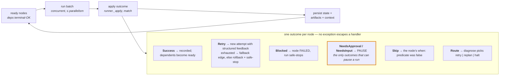
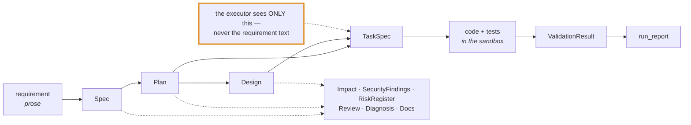

# Design — agentic SDLC orchestrator

**Agents propose · gates verify · humans approve.**
A ~4 minute read: what the system is, the four contracts it runs on, and why it is shaped this way.
Deeper detail lives in [`architecture.md`](architecture.md); how to run it is [`running.md`](running.md).

---

## 1. The problem, in three sentences

Hand a requirement to a coding agent and you get a diff nobody can defend: no record of what was decided, no point
where a human could have said no, no evidence the result matches the requirement, and no way to reproduce it. Teams
compensate by reviewing every line — which puts the human back in the slowest seat.

This orchestrator moves the human from **reading diffs** to **approving proposals**, and moves correctness from
**reading code** to **mechanical gates**.

**Goals:** the SDLC as an explicit graph that is data, not code · agents implement from typed artifacts, never from
raw prose · policy decides what may be touched, run and merged · gates decide when a stage is done · high-impact
actions cannot proceed without a human · every decision is an event · the whole thing replays without an API key.

**Non-goals:** a general workflow engine (the governance semantics *are* the product) · autonomous merge (release is
always a checkpoint) · a code-quality oracle (acceptance review is advisory) · a sandbox strong enough for hostile
code (it is process + path policy).

---

## 2. Flow — what a run does

```mermaid
flowchart TD
    REQ["requirement<br/><i>agent</i>"] --> CLR["clarify<br/><i>input: ambiguities</i>"]
    CLR -. "human answers &rarr; spec v2" .-> REQ
    CLR --> PLN["planning<br/><i>task DAG</i>"]
    PLN --> ARCH["architecture<br/><i>API, data, classes</i>"]
    PLN --> IMP["impact<br/><i>brownfield only</i>"]
    ARCH --> SEC["security_review"]
    ARCH --> RSK["risk_analysis"]
    IMP --> RSK
    SEC --> AD
    RSK --> AD
    AD{{"&#9733; approval_design<br/><i>human decides on the proposal</i>"}}
    AD --> IMPL["implementation<br/><i>task DAG in a git sandbox</i>"]
    IMPL -. "&#9733; per HIGH task<br/>or scope request" .-> IMPL
    IMPL --> UT["unit_tests"]
    IMPL --> CR["code_review<br/><i>advisory</i>"]
    IMPL --> IT["integration_tests"]
    UT --> VAL
    CR --> VAL
    IT --> VAL
    VAL{"validation<br/><i>the verdict</i>"}
    VAL -- pass --> DOC["documentation"]
    VAL -- fail --> DIA["diagnose"]
    DOC --> RR["release_readiness"]
    RR --> AR{{"&#9733; approval_release"}}
    AR --> DONE(["COMPLETED"])
    DIA -- retry --> IMPL
    DIA -- replan --> PLN
    DIA -- halt --> STOP(["HALTED<br/><i>resumable</i>"])
    classDef human stroke:#e08a1e,stroke-width:3px
    classDef terminal stroke:#6b7280,stroke-width:2px
    class AD,AR,CLR human
    class DONE,STOP terminal
```

★ = the run stops until a human decides. `sdlc graph` renders the live graph from `workflow.yaml`; this drawing will
age, that command will not.

Four properties matter more than the specific stages:

- **Non-linear** — two fan-out/join points, an input loop, a fail path with three exits.
- **Stateful** — `RunState` is saved after every batch and every artifact version is kept, so a run is resumable and
  its history reconstructable.
- **Invalidating** — re-producing an artifact (spec v2, plan v2) invalidates its consumers, everything downstream,
  and their approvals. A changed plan can never ship on an old decision.
- **Bounded** — attempts, re-plans, tokens, dollars and wall-clock are capped; exhausting one is a *safe-stop*
  (persist, halt, resumable), never a crash and never an unbounded loop.

---

## 3. The control loop

The outcome set is **closed**: new behaviour means a new dataclass *and* a new `case` in `runner._apply`, so every
transition stays enumerable, testable and visible in review.

---

## 4. The four contracts

Everything the system guarantees rests on four contracts, each with one home and one owner.

### 4.1 Graph contract — `workflow.yaml`

A node is a stage. No stage is hard-coded in Python.

| Field | Meaning |
|---|---|
| `kind` | `agent` (one schema-constrained LLM call) · `executor` (applies tasks to the sandbox) · `gate` (deterministic checks) · `approval` (human checkpoint) · `input` (questions) |
| `depends_on` | Edges. All must be terminal-OK before the node is ready |
| `produces` | Artifacts written into cross-stage context |
| `invalidated_by` | Artifacts whose new version forces this node (and downstream) to re-run |
| `parallel_group` · `when` · `fallback` · `rolls_up` · `retries` · `rollback` · `high_impact` | concurrency · conditional skip · fail edge · gate roll-up · bounds · rollback strategy · the approval this node raises |

### 4.2 Artifact contract — typed, frozen, versioned

| Artifact | Producer | Carries | Consumed by |
|---|---|---|---|
| `Spec` | requirements | stories, acceptance criteria, ambiguities, non-goals | planner, clarify |
| `Plan` | planner | task DAG: deps, parallel groups, `impact_level`, `allowed_files`, DoD | executor, approval brief |
| `Design` | architecture | API contract, data model, classes, layering rules | executor, contract + architecture gates |
| `ValidationResult` | validation | per-gate outcomes, findings, verdict | diagnose, release |

Two consequences:

- **The spec-driven boundary.** The executor's prompt contains a `TaskSpec`, the operations to implement, the tables
  it may touch, the classes, the acceptance criteria and the last attempt's findings — **not** the requirement text.
  Typed inputs make verification mechanical: contract diff against the committed OpenAPI document, layering rules
  compiled into import-linter/ArchUnit contracts, acceptance criteria into test names.
- **Lineage for free.** A new version is a new file (`<name>.v<n>.json`); `ARTIFACT_WRITTEN` records producer and
  version, `NODE_PASSED` carries the version snapshot in force. "Why does this code exist" is answerable.

Every agent field is fully typed — structured outputs silently flatten free-form `dict`s, and a test asserts that no
schema degrades that way.

### 4.3 Policy contract — `policy.yaml`, enforced twice

```mermaid
flowchart TD
    T["task writes files"] --> C["git commit<br/><i>one commit per task</i>"]
    C --> WB{"&#9312; WRITE BOUNDARY<br/>scope? size? secrets?<br/>banned patterns? PII?"}
    WB -- pass --> NEXT["POLICY_DECISION=ALLOW<br/>&rarr; next task"]
    WB -- fail --> REV["POLICY_DECISION=VIOLATION<br/>git revert &rarr; ROLLED_BACK<br/>rejected/&lt;task&gt;.patch"]
    REV --> FB["structured feedback<br/>&rarr; next attempt"]
    FB --> T
    NEXT --> ALL["all tasks done"]
    ALL --> RG{"&#9313; RUN GATES<br/>scope + security diff the whole run<br/>against the sdlc/base tag"}
    RG -- pass --> ON["validation continues"]
    RG -- fail --> DIA["diagnose"]
    classDef check stroke:#e08a1e,stroke-width:3px
    class WB,RG check
```

| Path class | Who may write |
|---|---|
| `allowed_paths` | agents, freely |
| `protected_paths` | only under a named high-impact approval (migrations, dependency majors, infra, release config) |
| `forbidden_paths` | nobody, under any approval |

Policy also fixes budgets, retry/backoff, rollback strategy, safe-stop triggers, the sandbox command allow/deny
lists and the gate definitions. It is never edited to make a task pass, and every decision emits a
`POLICY_DECISION` event.

### 4.4 Trace contract — one append-only stream

Run and node lifecycle, attempts, rollbacks, fallbacks, LLM/executor/gate calls, policy decisions, approvals,
inputs, invalidation, re-plans, artifact writes. **Metrics are derived, never counted** — `trace/metrics.py` and
`sql/views.sql` compute task success rate, retries, rollbacks, MTTR, latency, cost, checkpoints and halt reason from
this stream. A stored counter would be a second truth that can disagree.

---

## 5. Human checkpoints

A checkpoint is worthless if the human is shown a truncated dump. At every pause the engine builds an **approval
brief**: design (endpoints, tables, packages, layering, decisions), plan (tasks, HIGH tasks, protected paths,
anything outside policy), security findings, risks, spend so far, and for brownfield the contract and structure diff
against the existing repo. The human decides on a proposal, not a diff.

Checkpoints are structural: `AWAITING_APPROVAL`/`AWAITING_INPUT` advance only through the API/CLI. Replay mode may
auto-approve (it is re-running decisions already made); live runs never do. An approval grants exactly the task and
the high-impact actions it names — nothing wider — and invalidation revokes what it invalidates
(`POLICY_DECISION=APPROVAL_REVOKED`).

---

## 6. Reproducibility

Work happens in `runs/<id>/sandbox/`: a git repo on branch `run/<id>`, one commit per task, `git revert` as the
rollback primitive — inspectable, and the same move a human would make.

| Backing | What it is | Why it exists |
|---|---|---|
| `anthropic` + Claude Code CLI | the real thing | production path |
| `recording` | wraps any backing, writes `runs/cache/` | re-recording only pays for what changed |
| `replay` | cached responses + recorded patches | a complete run in seconds, no key, CI-able golden run |
| `fake` | canned artifacts, **live** checkpoint semantics | exercises graph, gates and approvals offline; plants a scope violation on attempt 1 |

Cache keys hash the schema and prompt with run ids, shas and numbers normalised out, so a replay matches a recording
whose identifiers necessarily differ.

---

## 7. Extending it

| To add… | Do this |
|---|---|
| a stage | a node in `workflow.yaml` with `depends_on` + (agents/executors) `produces` + `invalidated_by`; a handler only for a new *kind* |
| an agent | a schema + `Agent` subclass in `agents/catalog.py`, a template in `prompts/` (placeholders are `Agent.reads`) |
| a gate | an entry under `policy.yaml#gates` (command or `internal:`), listed in a node's `gates:` |
| a rule | a change-control/security/compliance entry in `policy.yaml` — it must emit a `POLICY_DECISION` |
| an outcome | a dataclass in `engine/outcomes.py` **and** a `case` in `runner._apply` |
| a sink or store | implement the interface; `service.py` is the only composition root |

Dependency direction: `api → service → engine → {agents, executors, sandbox, trace, store}`, with `models` a leaf.

---

## 8. Known trade-offs

LLM non-determinism is mitigated (schema-constrained output, repair loop, replay) but not eliminated · the sandbox
is process + path policy, not a container · invalidation is node-level, so re-runs are coarser than necessary · the
offline loop covers only the python target stack · `when:` conditions are named predicates rather than an expression
language, deliberately, to keep the graph auditable · acceptance review is advisory, because humans own quality.

The full list, and the live-run failure behind each design change, is in
[`architecture.md`](architecture.md#risks-trade-offs-limitations).
