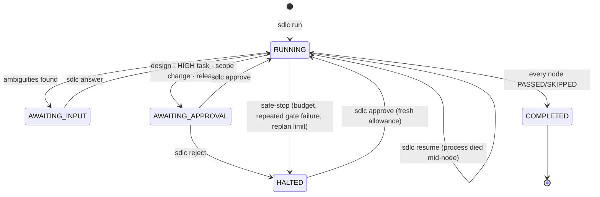

# Running — step by step

Two independent things live in this repository, and they run separately:

| | What it is | Steps | Needs |
|---|---|---|---|
| **Part A** | **The orchestrator** — the engine that turns a requirement into a governed run | [A1–A9](#part-a--the-orchestrator) | Python 3.12+ · (a key only for live runs) |
| **Part B** | **The url-shortener** — the Java project a run produced and delivered | [B1–B7](#part-b--the-delivered-url-shortener) | JDK 25 · Docker |

New here? Do **A1 → A2 → A3**. That is the full loop — agents, gates, a policy violation, a rollback, two human
approvals — offline, with no API key and no Docker, in about five minutes.

Design rationale: [`design.md`](design.md) · [`architecture.md`](architecture.md).

---
---

# Part A — the orchestrator

## A1. Install

**Prerequisites**

| Need | Required for | Check |
|---|---|---|
| Python 3.12+, git | everything | `python3 --version` |
| `ANTHROPIC_API_KEY` + `claude` CLI on `PATH` | live runs only (A5) | `which claude` |
| JDK 25 | live java runs (the gates compile real code) | `java -version` |
| Docker Engine | Part B only | `docker version` |

**Steps**

1. Get the code and create the virtualenv:
   ```bash
   git clone <repo> && cd agentic-orchestrator
   python3 -m venv .venv
   ```
2. Activate it — **every shell that runs `make` or `sdlc` needs this line**:
   ```bash
   . .venv/bin/activate
   ```
3. Install the package and its dev tools:
   ```bash
   make install                 # pip install -e ".[dev]"
   ```
4. Prove the engine is sound before trusting a run:
   ```bash
   make test && make lint       # ~2.5 min → "165 passed", then ruff + mypy clean
   ```

## A2. Start the API

The `sdlc` CLI is a thin client over the API, so `sdlc run/approve/answer/status` need a server running. (Only
`sdlc metrics`, `sdlc report` and `sdlc graph` read the run directory directly and work without one.)

1. In **shell 1**, start the API in offline mode (canned agents, python target stack):
   ```bash
   . .venv/bin/activate
   SDLC_LLM=fake SDLC_TARGET_STACK=python make run
   ```
   → `Uvicorn running on http://127.0.0.1:8080`. Leave it running.
2. In **shell 2**, check it and keep this shell for every command below:
   ```bash
   . .venv/bin/activate
   curl -s localhost:8080/healthz       # → {"status":"ok"}
   ```

> Settings are read once at startup. Changing an `SDLC_*` variable means restarting this process.

## A3. Offline demo — a complete run, no key

`SDLC_LLM=fake` gives canned agents with **real** graph, gates, policy and checkpoints. Attempt 1 of
`implementation` deliberately writes `.env`, a forbidden path, so the run shows a real violation and rollback.

1. Start the run:
   ```bash
   sdlc run --scenario greenfield
   ```
   → prints the run id, node statuses and the design approval brief. Keep the id:
   ```bash
   RUN=<run_id from the output>
   ```
   → status is `AWAITING_APPROVAL` at `approval_design`.
2. Read what you are being asked to approve:
   ```bash
   sdlc brief $RUN approval_design
   ```
   → design (endpoints, tables, packages, layering), plan with its HIGH tasks and protected paths, security
   findings, risks, spend so far.
3. Approve the design:
   ```bash
   sdlc approve $RUN approval_design
   ```
   → implementation runs: attempt 1 violates scope → commit reverted → attempt 2 clean. The run then pauses again
   on the HIGH task.
4. Approve that task:
   ```bash
   sdlc approve $RUN implementation
   ```
   → gates (scope, compile, style, security, architecture, unit, integration, contract) → validation →
   documentation → release_readiness.
5. Approve the release:
   ```bash
   sdlc approve $RUN approval_release
   ```
   → `COMPLETED`.
6. Look at what happened:
   ```bash
   sdlc metrics $RUN            # success rate, retries, rollbacks, MTTR, latency, cost, checkpoints
   sdlc report $RUN             # writes runs/$RUN/run_report.md — the whole run as one document
   ```
7. Confirm the governance actually fired:
   ```bash
   grep -c VIOLATION runs/$RUN/trace.jsonl      # the planted .env write
   grep -c ROLLED_BACK runs/$RUN/trace.jsonl    # the revert
   ls runs/$RUN/rejected/                       # the diff that was refused
   git -C runs/$RUN/sandbox log --oneline       # one commit per task on branch run/$RUN
   ```

## A4. Replay a recorded run (no key, unattended)

Agent responses come from `runs/cache/llm/`, task patches from `runs/cache/changesets/`. Replay is the only mode
allowed to auto-approve (`policy.autonomy.auto_approve_in_replay`), so it finishes without you.

1. Start the API with default settings (`--replay` overrides the mode):
   ```bash
   make run
   ```
2. Replay the recorded java run:
   ```bash
   sdlc run --scenario greenfield --replay
   ```
   → the url-shortener is rebuilt in seconds and the run reaches `COMPLETED`.

Cache keys hash the schema and prompt with run ids, shas and numbers normalised out, so a replay matches its
recording despite different identifiers. Change a prompt or schema and that entry misses — re-record it (A5).

## A5. Live run (API key required)

1. Configure credentials:
   ```bash
   cp .env.example .env
   ```
   Set `ANTHROPIC_API_KEY`. Leave `ANTHROPIC_WORKSPACE_ID` **unset** unless your key is not workspace-scoped, and
   then only a real `wrkspc_...` id — a workspace *name* there makes every call 401.
2. Check the executor is available:
   ```bash
   which claude                 # the implementation node shells out to the Claude Code CLI
   ```
3. Start the API live (no `SDLC_LLM` override) and launch the run:
   ```bash
   make run                                       # shell 1
   sdlc run --scenario greenfield --record        # shell 2; --record also fills the replay cache
   ```
4. Answer and approve as the run pauses — in this order:

   | Pause | What it means | Command |
   |---|---|---|
   | `clarify` | The requirements agent found ambiguities | `sdlc answer $RUN '{"AMB-1": "..."}'` |
   | `approval_design` | **A human must decide this one.** The design and plan proposal | `sdlc brief $RUN approval_design` then `sdlc approve …` |
   | `implementation` | A HIGH task (migration, dependency major, release config) or a `task.scope_change` request | `sdlc approve $RUN implementation` |
   | `approval_release` | The release checkpoint, with the run report | `sdlc approve $RUN approval_release` |

5. Deliver the result (A9).

Live runs never auto-approve. Budgets in `policy.yaml` (tokens, USD, 60 wall-clock minutes excluding human waits,
3 attempts per task, 2 re-plans) safe-stop the run instead of letting it drift; approving the halted node resumes
it with a fresh allowance.

## A6. The other two scenarios

Both work offline with the A2 settings (`SDLC_LLM=fake SDLC_TARGET_STACK=python`).

**Brownfield** — a run against an existing codebase:
```bash
sdlc run --scenario brownfield --workspace tests/fixtures/brownfield_ws
```
→ the workspace is copied into the sandbox and repo-mapped, the `impact` node runs, two HIGH tasks
(`schema.migration`, `dependency.major_version`) each pause for approval, and the compliance scan catches a
persisted raw IP on attempt 1.

**Ambiguous** — a requirement that cannot be implemented as written:
```bash
sdlc run --scenario ambiguous                                  # pauses with 6 questions
sdlc answer $RUN '{"AMB-1": "30 days", "AMB-2": "..."}'        # → spec v2
```
→ spec v2 invalidates planning and everything downstream; a planted failing test then drives
validation → diagnose → replan (plan v2, v3) until `replan.limit_reached` safe-stops the run.

The requirement text is `specs/scenarios/<scenario>.md`. To send your own text, post it directly (the CLI always
uses the scenario file):
```bash
curl -X POST localhost:8080/runs -H 'content-type: application/json' \
     -d '{"scenario":"greenfield","requirement_text":"..."}'
```

## A7. Driving a paused run




| Run status | Situation | Command |
|---|---|---|
| `AWAITING_INPUT` | Clarification questions | `sdlc answer $RUN '{"AMB-1": "..."}'` |
| `AWAITING_APPROVAL` | Design, release, HIGH task or scope change | `sdlc brief $RUN <node>` → `sdlc approve $RUN <node>` |
| `AWAITING_APPROVAL` | You want to stop it instead | `sdlc reject $RUN <node> --reason "..."` → `HALTED` |
| `HALTED` | Safe-stop (budget, repeated gate failure, unrecoverable diagnosis) | `sdlc approve $RUN <node>` resumes with a reset allowance |
| `RUNNING` but nothing moves | The API process died mid-node | `sdlc resume $RUN` (409 for paused/halted runs — use approve/answer) |

`sdlc status $RUN` shows run status, every node's status and pending questions. Approving grants exactly the task
and the high-impact actions it names; a blocked task that asks for files outside its scope gets exactly those files.

## A8. Inspecting a run

```
runs/<id>/
  state.json                  node statuses, budget, artifact versions, halt reason
  artifacts/<name>.v<n>.json  every version of spec, plan, design, impact, findings, results, report
  trace.jsonl                 append-only TraceEvents — the only source of truth for metrics
  approvals.jsonl             who decided what, when
  context.json                feedback, answers, approval tokens (used by resume)
  sandbox/                    git repo, branch run/<id>, one commit per task
  rejected/<task>.patch       diffs reverted by a policy violation
```

```bash
sdlc status $RUN       # live state (needs the API)
sdlc metrics $RUN      # derived from trace.jsonl only
sdlc report $RUN       # runs/<id>/run_report.md: requirement → spec → design → plan → decisions → timeline →
                       # per-task execution → gates → metrics → lineage → limitations
sdlc graph             # mermaid of workflow.yaml
```

## A9. Delivering the result

```bash
sdlc deliver $RUN                    # after approval_release: copies the sandbox tree to SDLC_WORKSPACE
sdlc deliver $RUN --to path/to/dir   # or somewhere else
```

The first delivered project is [`workspace/url-shortener`](../workspace/url-shortener) — that is Part B.

## A10. Configuration reference

`SDLC_*` environment variables or lines in `.env`; paths resolve from the working directory, so start the API from
the repo root. Defaults: [`src/orchestrator/config.py`](../src/orchestrator/config.py).

| Variable | Default | Effect |
|---|---|---|
| `SDLC_LLM` | `auto` | `auto` (anthropic if a key is set, else replay) · `fake` (canned agents, no network, live checkpoints) · `replay` · `anthropic` |
| `SDLC_TARGET_STACK` | `java` | Gate commands and repo-map parser. Offline runs need `python` — the fake executor only writes python |
| `SDLC_WORKSPACE` | `./workspace/url-shortener` | Brownfield source, and the default destination of `sdlc deliver`. Empty/missing ⇒ greenfield |
| `SDLC_MODEL` | `claude-opus-5` | Model for agent calls |
| `SDLC_RUNS_DIR` | `./runs` | Where `runs/<id>/` goes |
| `SDLC_CACHE_DIR` | `./runs/cache` | Replay cache (`llm/`, `changesets/`) |
| `SDLC_WORKFLOW_PATH` · `SDLC_POLICY_PATH` | `workflow.yaml` · `policy.yaml` | The graph and the law |
| `ANTHROPIC_API_KEY` | — | Live runs; absent ⇒ `auto` resolves to replay |
| `ANTHROPIC_WORKSPACE_ID` | — | Only for non-workspace-scoped keys, only a real `wrkspc_...` id |

## A11. Troubleshooting

| Symptom | Cause | Fix |
|---|---|---|
| `sdlc: command not found` | venv not active | `. .venv/bin/activate` |
| Every `sdlc` command fails to connect | API not running | Start A2; check `curl localhost:8080/healthz` |
| `404 unknown run` | No such run directory (a typo, or a different `SDLC_RUNS_DIR`) | `ls runs/`; runs themselves survive an API restart — they reload from disk |
| Every live call 401s | `ANTHROPIC_WORKSPACE_ID` set to a workspace *name* | Unset it, or use the real `wrkspc_...` id |
| Run goes to replay although a key is set | `.env` not loaded (wrong working directory) or `SDLC_LLM=replay` | Start the API from the repo root; check `SDLC_LLM` |
| `--record` refused | The resolved mode is replay — nothing to record | Drop `--replay` |
| Replay stops at an unknown response | Prompt or schema changed since recording | Re-record that scenario with a key, or revert the prompt |
| Offline run fails in compile/style | `SDLC_TARGET_STACK=java` with the fake executor | Use `python` |
| Port 8080 already bound | An older uvicorn, or the standalone url-shortener (B5) | `lsof -i :8080` and kill it |
| `budget.exceeded:wall_clock` halt | 60-minute default (human waits excluded) | Approve the halted node to resume with a fresh clock |
| Scope gate fails on a file a task needed | Missing grant | Approve the `task.scope_change` pause — never widen `policy.yaml` to pass |

Starting fresh: delete `runs/<id>/` for one run. **Keep `runs/cache/`** — that is the replay corpus, not output.

---
---

# Part B — the delivered url-shortener

A standalone Spring Boot 4 / Java 25 project in [`workspace/url-shortener`](../workspace/url-shortener): PostgreSQL
for the mappings, Redis for the short-code counter and redirect cache, Kafka for click analytics. It does not need
the orchestrator to build or run.

## B1. Prerequisites

| Need | Why | Check |
|---|---|---|
| JDK 25 | build and run (`./mvnw` fetches Maven itself) | `java -version` → `25.x` |
| Docker Engine | Postgres + Redis + Kafka, and Testcontainers for the integration tests | `docker version` |
| Network access to Maven Central + Docker Hub | first build only | |

## B2. Build and test

From `workspace/url-shortener`:

1. Compile and run the unit tests (no Docker needed; the first run downloads Maven):
   ```bash
   ./mvnw -q test
   ```
2. Run the same checks the orchestrator's gates run:
   ```bash
   ./mvnw -q spotless:check                 # formatting
   ./mvnw -q -Dtest=ArchitectureTest test   # layering rules
   ./mvnw -q -Pit verify                    # unit + integration; starts containers, ~10 min
   ```

## B3. Run it with the one-command stack (recommended)

From the **repository root**:

1. Start everything (builds the project's Dockerfile):
   ```bash
   make shortener-up
   ```
   → Postgres on `:5433`, Redis on `:6380`, Kafka on `:9094`, the app on **`:8081`**. These ports are deliberately
   off the defaults so the orchestrator's own Postgres/Redis (5432/6379) can run alongside.
2. Wait until it is up:
   ```bash
   make shortener-logs          # → "Started UrlShortenerApplication"; Ctrl-C to stop tailing
   ```

## B4. Use the API

1. Create a short link:
   ```bash
   curl -s -X POST localhost:8081/api/v1/urls -H 'content-type: application/json' \
        -d '{"long_url":"https://example.com/a/very/long/path"}'
   ```
   → `201` with `short_url`, `short_code`, `expires_at` and `code_source` (`redis` normally, `db_sequence` if Redis
   was unreachable at allocation).
2. Follow the redirect:
   ```bash
   curl -si localhost:8081/<short_code> | head -3     # → 302 + Location
   curl -si localhost:8081/nope | head -3             # → 404 application/problem+json
   ```
3. Optional extras (Swagger UI is the quickest way to exercise the API by hand — the operations it lists depend on
   the active profile; see the project's [Swagger section](../workspace/url-shortener/README.md#trying-the-api-in-swagger-ui)):
   ```bash
   curl -s -X POST localhost:8081/api/v1/urls -H 'content-type: application/json' \
        -d '{"long_url":"https://example.com/docs","custom_alias":"docs","expiration_date":"2030-01-01T00:00:00Z"}'
   curl -s localhost:8081/api/v1/urls/<short_code>/stats    # click analytics: totals + per-day counts
   open http://localhost:8081/swagger-ui.html               # interactive docs: Try it out runs against :8081
                                                            # raw document: /v3/api-docs (JSON), /v3/api-docs.yaml
   ```

## B5. Look at the data

From the repository root:

```bash
make shortener-psql     # then: select short_code, long_url, code_source, expires_at from urls;
make shortener-redis    # then: keys shortener:*   /   get shortener:url:<short_code>
make shortener-kafka    # tail the url.clicked topic (one record per redirect)
```

## B6. Run it standalone (without compose)

Only if you already have Postgres and Redis. From `workspace/url-shortener`:

```bash
SHORTENER_DB_URL=jdbc:postgresql://localhost:5432/shortener \
SHORTENER_DB_USERNAME=shortener SHORTENER_DB_PASSWORD=shortener \
SHORTENER_REDIS_HOST=localhost ./mvnw spring-boot:run
```
→ serves on **`:8080`** (set `SERVER_PORT` to move it — 8080 is also the orchestrator's API port).

Flyway runs the migrations on start-up; the schema is validated against the JPA model, never generated. Full
configuration table: the project's [README](../workspace/url-shortener/README.md#configuration).

**Deployment surfaces.** `SPRING_PROFILES_ACTIVE` picks which HTTP surface is registered, so read and write scale
independently:

| Profile | Serves | Answers 404 |
|---|---|---|
| _(none)_ | both | — |
| `read` | `GET /{short_code}` | `POST /api/v1/urls` |
| `write` | `POST /api/v1/urls`, `/stats` | `GET /{short_code}` |

## B7. Stop and reset

```bash
make shortener-down                              # stop the stack (the Postgres volume survives)
docker volume rm agentic-orchestrator_shortener-pgdata   # wipe the data too
```

## B8. Troubleshooting

| Symptom | Cause | Fix |
|---|---|---|
| `./mvnw` cannot download Maven | proxy / no network | Set `MAVEN_OPTS` proxy settings or pre-populate `~/.m2` |
| "Could not find a valid Docker environment" | Docker not running, or your user cannot reach the socket | Start Docker; `./mvnw test` (unit only) still works without it |
| Port 5433/6380/8081 in use | another stack | `make shortener-down`, or change the mapping in `docker-compose.yml` |
| `code_source: db_sequence` on every write | Redis unreachable — degraded, not broken | Check `make shortener-redis`; see [`operations.md`](../workspace/url-shortener/docs/operations.md) |
| Redirects work but `/stats` stays at zero | Kafka not up, so the outbox is not relayed | `docker compose --profile shortener ps`; the relay retries on its own |
| App container restarts on boot | Postgres not healthy yet | It waits for health checks; `make shortener-logs` to confirm |

Deeper reference: [README](../workspace/url-shortener/README.md) (endpoints, configuration) ·
[DESIGN.md](../workspace/url-shortener/docs/DESIGN.md) (rationale, ADRs) ·
[operations.md](../workspace/url-shortener/docs/operations.md) (outages, counter gaps) ·
[analytics.md](../workspace/url-shortener/docs/analytics.md) (click pipeline).

---

## Command index

| Orchestrator | |
|---|---|
| `make install` · `make test` · `make lint` | install · pytest · ruff + mypy |
| `make run` | API on :8080 |
| `sdlc run --scenario greenfield [--replay\|--record] [--workspace DIR]` | start and drive a run |
| `sdlc status/brief/approve/reject/answer/resume <run> [node]` | inspect and drive checkpoints |
| `sdlc metrics/report/deliver <run>` · `sdlc graph` | outputs |

| url-shortener | |
|---|---|
| `./mvnw test` · `./mvnw -Pit verify` | unit · full verification with containers |
| `make shortener-up` · `-logs` · `-down` | start · tail · stop the stack |
| `make shortener-psql` · `-redis` · `-kafka` | inspect the data |
