# url-shortener

A small, production-shaped URL shortener: Spring Boot 4 on Java 25, PostgreSQL for the
mappings, Redis for the short-code counter and the redirect cache.

* `POST /api/v1/urls` turns an absolute `http`/`https` URL into a short link.
* `GET /{short_code}` redirects to the stored long URL.

The API contract is the committed OpenAPI document at
[`src/main/resources/openapi.yaml`](src/main/resources/openapi.yaml). It is compared
operation-by-operation and status-code-by-status-code against the running application by
`OpenApiContractIT`, so the file and the code cannot drift. A running instance also serves the
live document at `/v3/api-docs` (JSON), `/v3/api-docs.yaml` and Swagger UI at
`/swagger-ui.html`.

## Quick start on a new machine

The whole project is self-contained: a Maven wrapper, Flyway migrations and Testcontainers-based tests. You need:

| Prerequisite | Why | Check |
|---|---|---|
| Git | clone the repository | `git --version` |
| JDK 25 (Temurin, GraalVM or OpenJDK) | build and run; `./mvnw` downloads Maven itself | `java -version` prints `25.x` |
| Docker Engine (or Docker Desktop) | Postgres + Redis for running, Testcontainers for `-Pit verify` | `docker version` |
| Network access to Maven Central and Docker Hub on the first build | dependencies and base images | |

1. **Clone** (this project lives inside the agentic-orchestrator repository):
   ```bash
   git clone https://github.com/<your-org>/agentic-orchestrator.git
   cd agentic-orchestrator/workspace/url-shortener
   ```
2. **Compile and run the unit tests** — no Docker needed; the first run downloads Maven (~1 min):
   ```bash
   ./mvnw -q test
   ```
3. **Run the full verification** the pipeline's gates run (integration tests start PostgreSQL, Redis and Kafka
   through Testcontainers, so Docker must be up; ~10 min):
   ```bash
   ./mvnw -q spotless:check                 # formatting
   ./mvnw -q -Dtest=ArchitectureTest test   # layering rules
   ./mvnw -q -Pit verify                    # unit + integration + the OpenAPI parity dump
   ```
4. **Start it.** Either the one-command stack from the orchestrator repository (recommended):
   ```bash
   cd ../..                     # repository root
   make shortener-up            # PostgreSQL :5433, Redis :6380, Kafka :9094, app :8081
   make shortener-logs          # wait for "Started UrlShortenerApplication", then Ctrl-C
   ```
   …or standalone against your own PostgreSQL and Redis (see [Running locally](#running-locally)), which serves
   on `:8080`:
   ```bash
   cd workspace/url-shortener
   SHORTENER_DB_URL=jdbc:postgresql://localhost:5432/shortener SHORTENER_DB_USERNAME=shortener \
   SHORTENER_DB_PASSWORD=shortener SHORTENER_REDIS_HOST=localhost ./mvnw spring-boot:run
   ```
5. **Try it** (port 8081 with the compose stack, 8080 standalone):
   ```bash
   curl -s -X POST localhost:8081/api/v1/urls -H 'content-type: application/json' \
        -d '{"long_url":"https://example.com/a/very/long/path"}'
   #   -> 201 {"short_url":"http://localhost:8081/100001","short_code":"100001",...}
   curl -si localhost:8081/100001        # -> 302, Location: https://example.com/a/very/long/path
   curl -si localhost:8081/nope          # -> 404 application/problem+json
   open http://localhost:8081/swagger-ui.html
   ```
6. **Look at the data** (compose stack, from the repository root):
   ```bash
   make shortener-psql       # then: select short_code, long_url, code_source, expires_at from urls;
   make shortener-redis      # then: keys shortener:*   /   get shortener:url:100001
   make shortener-kafka      # tail the url.clicked topic
   make shortener-down       # stop everything
   ```

Troubleshooting:

- `./mvnw` fails to download Maven: set `MAVEN_OPTS` proxy settings or pre-populate `~/.m2`; the wrapper reads
  `.mvn/wrapper/maven-wrapper.properties`.
- Integration tests fail with "Could not find a valid Docker environment": Docker is not running or your user
  cannot access the socket; unit tests still run with `./mvnw test`.
- Port already in use: the compose stack uses 5433/6380/8081 precisely to avoid the default ports; override
  `SERVER_PORT` when running standalone.
- Redis down at runtime is not an error: the read path serves from Postgres and the write path falls back to the
  database sequence (`code_source = db_sequence`); see [docs/operations.md](docs/operations.md).

Design rationale, ADRs and the layering rules: [docs/DESIGN.md](docs/DESIGN.md).

## Trying the API in Swagger UI

A running instance serves the interactive documentation itself — no file to import, no client to install:

| What | Path | Notes |
|---|---|---|
| Swagger UI | `/swagger-ui.html` | `http://localhost:8081/swagger-ui.html` with `make shortener-up`, `http://localhost:8080/swagger-ui.html` standalone or `docker run` |
| Live document (JSON) | `/v3/api-docs` | generated by springdoc from the beans that are actually registered |
| Live document (YAML) | `/v3/api-docs.yaml` | the exact content `OpenApiContractIT` compares with the committed [`src/main/resources/openapi.yaml`](src/main/resources/openapi.yaml) |

1. Open Swagger UI on the port your instance uses. Three operations are listed, grouped by tag: **urls**
   (`createShortUrl`), **redirect** (`redirectToLongUrl`) and **analytics** (`getUrlClickStats`).
2. Expand `POST /api/v1/urls` → **Try it out** → edit the example body → **Execute**. The response pane shows the
   `201` body with `short_code` and `code_source`, and the `curl` equivalent it just ran.
3. Paste that `short_code` into `GET /api/v1/urls/{short_code}/stats` → **Execute** to see the click aggregates
   (`0` / `null` / `[]` until the link is used, and they lag the redirect by the analytics pipeline's latency).
4. For `GET /{short_code}`, the browser follows the `302` before Swagger UI can show it, so the response pane
   reflects the destination rather than the redirect. To inspect the redirect itself use
   `curl -si localhost:8081/<short_code>`, which shows the `Location` and `Cache-Control: private` headers.

Two things worth knowing:

- **Try it out targets the host you loaded the UI from**, because the UI reads the live document rather than the
  committed file. The `servers: http://localhost:8080` entry in the committed `openapi.yaml` is just the port the
  `-Pit` build dumped it on.
- **The UI reflects the deployment surface.** A `SPRING_PROFILES_ACTIVE=read` instance registers only the redirect
  controller, so that is the only operation listed (and the other two answer `404`); a `write` instance lists
  `createShortUrl` and `getUrlClickStats` but not the redirect. See
  [Deployment model: Spring profiles](#deployment-model-spring-profiles).

## Endpoints

### `POST /api/v1/urls` — `createShortUrl`

Request body (`application/json`):

| Field             | Required | Rules                                                                 |
|-------------------|----------|-----------------------------------------------------------------------|
| `long_url`        | yes      | absolute `http://` or `https://` URL, not blank, at most 2048 characters |
| `custom_alias`    | no       | `[0-9a-zA-Z]`, 3 to 32 characters; used verbatim as the short code    |
| `expiration_date` | no       | RFC 3339 date-time in the future                                      |

Identical long URLs are never deduplicated: every call creates a new mapping.

| Status | Meaning                                                                                        |
|--------|------------------------------------------------------------------------------------------------|
| `201`  | Created. Body: `short_url`, `short_code`, `long_url`, `expires_at` (nullable), `code_source`.   |
| `400`  | Invalid `long_url`, `custom_alias` or `expiration_date`, or unreadable JSON. Nothing persisted. |
| `409`  | `custom_alias` (or a generated code) already taken. The existing mapping is unchanged.          |
| `500`  | Unhandled server error.                                                                        |

```bash
curl -s -X POST http://localhost:8080/api/v1/urls \
  -H 'Content-Type: application/json' \
  -d '{"long_url":"https://example.com/docs?page=1","custom_alias":"docs","expiration_date":"2030-01-01T00:00:00Z"}'
```

```json
{
  "short_url": "http://localhost:8080/docs",
  "short_code": "docs",
  "long_url": "https://example.com/docs?page=1",
  "expires_at": "2030-01-01T00:00:00Z",
  "code_source": "redis"
}
```

### `GET /{short_code}` — `redirectToLongUrl`

| Status | Meaning                                                                          |
|--------|----------------------------------------------------------------------------------|
| `302`  | `Location` is the stored `long_url`; `Cache-Control: private` on every redirect. |
| `404`  | Short code unknown in both cache and database.                                   |
| `410`  | Short code expired (`expires_at` in the past).                                   |
| `500`  | Unhandled server error.                                                          |

```bash
curl -si http://localhost:8080/docs | head -n 5
```

### Error format

Every non-2xx response, including unhandled `500`s, is rendered by one global exception
handler as RFC 9457 `application/problem+json` with `type`, `title`, `status`, `detail` and
`instance` (the request path). Internal details such as exception class names or stack
traces never appear in a body.

```json
{
  "type": "about:blank",
  "title": "Not Found",
  "status": 404,
  "detail": "Short code 'nope' is unknown",
  "instance": "/nope"
}
```

## `code_source` semantics

`code_source` says which counter produced a generated short code and is stored with the
mapping (column `urls.code_source`):

| Value         | Origin                                                                                  |
|---------------|-----------------------------------------------------------------------------------------|
| `redis`       | Normal path. The instance reserved a batch of values with one Redis `INCRBY` and handed one out. |
| `db_sequence` | Redis was unreachable when the code was allocated; the value came from the PostgreSQL sequence `url_code_seq`. |

Both counters are base62-encoded after adding a configurable seed offset, so generated codes are
always at least six characters and never restart from `a`. A `custom_alias` is stored as
supplied and bypasses both counters; its `code_source` is always `redis` (a fixed marker in
`UrlWriteService`, unrelated to Redis health) and carries no further meaning. For generated codes,
clients can treat `db_sequence` as a signal that the write side ran
degraded at that moment. See [`docs/operations.md`](docs/operations.md) for the outage
behaviour and the accepted counter gaps.

## Deployment model: Spring profiles

The two HTTP surfaces are independently registrable, so the read path can be scaled without
the write path (and vice versa). The surface is chosen with `SPRING_PROFILES_ACTIVE`:

| Profile        | Registers                                        | Not served                          |
|----------------|--------------------------------------------------|-------------------------------------|
| _(none)_ / `default` | both surfaces                               | —                                   |
| `read`         | `GET /{short_code}` only                         | `POST /api/v1/urls` answers `404`   |
| `write`        | `POST /api/v1/urls` only                         | `GET /{short_code}` answers `404`   |

`read` instances never reserve counter batches from Redis. A typical production layout is many
`read` replicas behind the public hostname and a few `write` replicas behind the API path.
Both talk to the same PostgreSQL database and the same Redis. `ProfileSeparationIT` verifies
the three combinations.

## Configuration

All settings are ordinary Spring properties and can be set as environment variables. Only
local-development defaults live in `application.yml`; real credentials come from the
environment (or your secret manager) and are never part of the image or the repository.

| Property                        | Environment variable         | Default                   | Purpose                                                           |
|---------------------------------|------------------------------|---------------------------|-------------------------------------------------------------------|
| `shortener.base-url`            | `SHORTENER_BASE_URL`         | `http://localhost:8080`   | Public base URL used to build `short_url` (trailing slash ignored). |
| `shortener.counter-batch-size`  | `SHORTENER_COUNTER_BATCH_SIZE` | `1000`                  | Counter values reserved per Redis `INCRBY`; unused remainder is lost on restart. |
| `shortener.cache-ttl`           | `SHORTENER_CACHE_TTL`        | `24h`                     | TTL of cached lookups for never-expiring links, and the upper bound for all others. |
| `shortener.counter-seed-offset` | `SHORTENER_COUNTER_SEED_OFFSET` | `916132832` (62^5)     | Added to the raw counter before base62 encoding; keeps generated codes at six or more characters. |
| `spring.datasource.url`         | `SHORTENER_DB_URL`           | local PostgreSQL          | JDBC URL of the `shortener` database.                             |
| `spring.datasource.username`    | `SHORTENER_DB_USERNAME`      | local dev value           | Database user.                                                    |
| `spring.datasource.password`    | `SHORTENER_DB_PASSWORD`      | local dev value           | Database credential; supply from the environment.                 |
| `spring.data.redis.host`        | `SHORTENER_REDIS_HOST`       | `localhost`               | Redis host.                                                       |
| `spring.data.redis.port`        | `SHORTENER_REDIS_PORT`       | `6379`                    | Redis port.                                                       |
| `server.port`                   | `SERVER_PORT`                | `8080`                    | HTTP port.                                                        |
| `spring.profiles.active`        | `SPRING_PROFILES_ACTIVE`     | _(none)_                  | Deployment surface, see above.                                    |

Flyway runs the migrations in `src/main/resources/db/migration` on start-up; the schema is
`validate`d against the JPA model, never generated.

## Click analytics

Every successful redirect is counted, asynchronously and without ever storing a raw client
address. The pipeline is a transactional outbox relayed to Kafka and aggregated by an in-process
consumer; [`docs/analytics.md`](docs/analytics.md) is the detailed reference.

```mermaid
flowchart TD
    REQ["GET /&#123;short_code&#125;"] --> R302["302 &rarr; client"]
    REQ -. "same transaction<br/>as the lookup" .-> OB["click_outbox<br/><i>status PENDING</i>"]
    OB --> POLL["OutboxPoller<br/><i>scheduler thread, never a request thread;<br/>FOR UPDATE SKIP LOCKED, bounded retries</i>"]
    POLL --> K(["Kafka topic url.clicked<br/><i>key = short code, idempotency-key header</i>"])
    K --> CON["ClickEventConsumer<br/><i>one transaction: processed_click_event dedupe + upserts</i>"]
    CON --> AGG[("click_stats<br/>click_stats_daily")]
    AGG --> API["GET /api/v1/urls/&#123;short_code&#125;/stats"]
    OB -. "raw rows older than<br/>analytics.retention.days" .-> PURGE["retention job<br/><i>aggregates are never purged</i>"]
    classDef store stroke:#6b7280,stroke-width:2px
    class AGG,K store
```



1. **Record** (`analytics.recording`): the redirect inserts one `click_outbox` row in the same
   transaction as the successful lookup. `404`/`410` responses insert nothing. The request thread
   never talks to Kafka, so a slow or unavailable broker cannot delay or fail a redirect
   (`KafkaUnavailableRedirectIT`, `RedirectLatencyBudgetIT`).
2. **Relay** (`analytics.outbox`): a poller claims due `PENDING` rows with `FOR UPDATE SKIP LOCKED`
   and publishes them to the `url.clicked` topic (key = short code, JSON value, `idempotency-key`
   header) with bounded retries, exponential backoff and jitter. Rows become `PUBLISHED` on
   acknowledgement or `FAILED` after the retry budget; several instances can relay concurrently.
3. **Aggregate** (`analytics.consumer`, `analytics.aggregation`): the consumer dedupes on
   `processed_click_event` and upserts `click_stats` / `click_stats_daily` in one transaction, so a
   redelivered record is a no-op (exactly-once aggregation, `ClickAnalyticsEndToEndIT`).
4. **Serve** (`analytics.api`): the stats endpoint below reads the aggregates.
5. **Purge** (`analytics.retention`): a daily job deletes raw rows older than the retention period;
   aggregates are kept.

### `GET /api/v1/urls/{short_code}/stats` — `getUrlClickStats`

Additive, under the existing `/api/v1` surface (registered on the default and `write` profiles,
`404` on `read`-only instances like `POST /api/v1/urls`).

```bash
curl -s localhost:8080/api/v1/urls/100001/stats
# 200 {"total_clicks":3,"last_clicked_at":"2026-09-14T10:15:30Z","as_of":"2026-09-14T10:15:31Z",
#      "clicks_by_day":[{"date":"2026-09-13","count":1},{"date":"2026-09-14","count":2}]}
```

| Status | When | Body |
|---|---|---|
| `200` | known short code, clicked or not (`0` / `null` / `[]` for a never-clicked link) | `total_clicks`, `last_clicked_at`, `as_of` (freshness of the aggregate), sparse ascending `clicks_by_day` over the last 30 UTC days |
| `404` | unknown short code | `application/problem+json` |

The numbers lag behind the redirects by the relay + consumer latency; `as_of` says how fresh they
are. The code base has no `/api/v1` authentication scheme (a stated non-goal), so the endpoint
carries no `401` today; adding one is a separate, approved change.

### Analytics configuration

| Property | Environment variable | Default | Purpose |
|---|---|---|---|
| `analytics.salt` | `SHORTENER_ANALYTICS_IP_SALT` | non-secret local marker | Secret salt of the client-IP hash (≥ 16 characters). **Must** be set in production; supply it from the environment or a CI/deployment secret, never commit it. |
| `spring.kafka.bootstrap-servers` | `SHORTENER_KAFKA_BOOTSTRAP_SERVERS` | `localhost:9092` | Broker address of the `url.clicked` topic. |
| `analytics.outbox.poll-interval-ms` | `ANALYTICS_OUTBOX_POLL_INTERVAL_MS` | `500` | Delay between two relay passes (50 ms – 60 s). |
| `analytics.outbox.batch-size` | `ANALYTICS_OUTBOX_BATCH_SIZE` | `100` | Rows relayed per pass (1 – 10 000). |
| `analytics.retry.max-attempts` | `ANALYTICS_RETRY_MAX_ATTEMPTS` | `5` | Publish / aggregation attempts before giving up. |
| `analytics.retry.base-backoff-ms` / `max-backoff-ms` | `ANALYTICS_RETRY_BASE_BACKOFF_MS` / `ANALYTICS_RETRY_MAX_BACKOFF_MS` | `100` / `10000` | Exponential backoff bounds. |
| `analytics.retry.jitter` | `ANALYTICS_RETRY_JITTER` | `full` | `full`, `equal` or `none`. |
| `analytics.kafka.timeout-ms` | `ANALYTICS_KAFKA_TIMEOUT_MS` | `5000` | Bound of one produce request / aggregation attempt. |
| `analytics.consumer.auto-startup` | `ANALYTICS_CONSUMER_AUTO_STARTUP` | `true` | Start the `url.clicked` listener with the application. |
| `analytics.retention.days` | `ANALYTICS_RETENTION_DAYS` | `90` | Age after which raw click rows are purged (1 – 3650). |
| `analytics.retention.cron` | `ANALYTICS_RETENTION_CRON` | `0 0 3 * * *` | Purge schedule (UTC). |

### Privacy and retention guarantees

* **The client's network identifier is never stored or logged in clear text.** Only a salted
  SHA-256 digest (`hashed_ip`, 64 hex characters, enforced by a check constraint) reaches the
  database and the topic; the plain value is discarded on the request thread. The salt
  lives outside the repository (`SHORTENER_ANALYTICS_IP_SALT`); the checked-in fallback exists
  only so local runs and tests boot, and a leaked salt is rotated by changing the variable.
* **Referrers are reduced to the host name** (lower-cased, no path, query or credentials).
* **No personal data columns** exist in any analytics table (`ClickAnalyticsMigrationTest` pins
  this); log lines carry short codes, keys and counts, never digests or referrers.
* **Raw events are kept for `analytics.retention.days` (90 days)**: `click_outbox` rows and
  `processed_click_event` markers older than that are deleted by the retention job.
  `click_stats` and `click_stats_daily` are aggregates and are kept for the life of the link.
* **Counting is exactly-once** at the aggregate level (outbox idempotency key + consumer dedupe),
  and the redirect never depends on the broker.

## Running locally

Prerequisites: JDK 25, Docker (for the databases and the integration tests). Maven is
provided by the wrapper.

1. Start PostgreSQL and Redis, for example with plain containers:

   ```bash
   # local development only: trust authentication, no credential to manage
   docker run -d --name shortener-db -p 5432:5432 \
     -e POSTGRES_DB=shortener -e POSTGRES_USER=shortener -e POSTGRES_HOST_AUTH_METHOD=trust \
     postgres:17-alpine
   docker run -d --name shortener-redis -p 6379:6379 redis:7-alpine
   ```

   The defaults in `application.yml` match this setup. Any other PostgreSQL 17 and Redis 7
   work too: export the `SHORTENER_DB_*` and `SHORTENER_REDIS_*` variables from your shell
   or secret manager before starting the application.

2. Run the application (both surfaces):

   ```bash
   ./mvnw spring-boot:run
   # read-only or write-only surface:
   SPRING_PROFILES_ACTIVE=read  ./mvnw spring-boot:run
   SPRING_PROFILES_ACTIVE=write ./mvnw spring-boot:run
   ```

3. Build and test:

   | Command                                        | What it does                                                   |
   |------------------------------------------------|----------------------------------------------------------------|
   | `./mvnw -q -DskipTests compile`                | compile                                                        |
   | `./mvnw -q spotless:check`                     | google-java-format check (`spotless:apply` fixes)              |
   | `./mvnw -q -Dtest=ArchitectureTest test`       | layering rules (`src/test/java/sdlc/ArchitectureTest.java`)    |
   | `./mvnw -q test`                               | unit tests (`*Test`), no Docker needed                         |
   | `./mvnw -q -Pit verify`                        | integration tests (`*IT`) against Testcontainers PostgreSQL, Redis and Kafka, including the redirect latency gate (`RedirectLatencyBudgetIT`), and the springdoc dump to `target/openapi.yaml` / `target/openapi.json` |

   The same commands, in the same order, form the CI pipeline in
   [`.github/workflows/ci.yml`](.github/workflows/ci.yml).

## Running with Docker

The [`Dockerfile`](Dockerfile) is a two-stage build: a JDK 25 stage runs
`./mvnw -DskipTests package`, a slim JRE 25 stage runs the fat jar as the unprivileged
`shortener` user on port 8080. The image contains no configuration secrets.

```bash
docker build -t url-shortener .

# combined surface, talking to the containers from "Running locally"
docker run --rm -p 8080:8080 \
  -e SHORTENER_DB_URL=jdbc:postgresql://host.docker.internal:5432/shortener \
  -e SHORTENER_DB_USERNAME=shortener \
  -e SHORTENER_DB_PASSWORD \
  -e SHORTENER_REDIS_HOST=host.docker.internal \
  -e SHORTENER_BASE_URL=http://localhost:8080 \
  url-shortener

# dedicated surfaces
docker run --rm -p 8081:8080 -e SPRING_PROFILES_ACTIVE=read  ... url-shortener
docker run --rm -p 8082:8080 -e SPRING_PROFILES_ACTIVE=write ... url-shortener
```

`-e SHORTENER_DB_PASSWORD` without a value forwards the variable from the calling shell, so the
credential never appears on the command line or in the image. Pass `-e SHORTENER_ANALYTICS_IP_SALT`
and `-e SHORTENER_KAFKA_BOOTSTRAP_SERVERS=...` the same way for the click analytics pipeline. `JAVA_OPTS` (default
`-XX:MaxRAMPercentage=75.0 -XX:+ExitOnOutOfMemoryError`) can be overridden the same way.

## Project layout

```
src/main/java/com/example/shortener/
  api/dto      request / response records (JSON names of the contract)
  api/error    domain exceptions + GlobalExceptionHandler (problem+json)
  codegen      Base62Codec, RedisBatchCounterSource, DbSequenceCounterSource, ShortCodeAllocator
  config       ShortenerProperties (shortener.* namespace)
  domain       UrlMapping entity, UrlMappingRepository, CodeSource
  read         RedirectController, UrlReadService, RedisUrlCache      (@Profile("!write"))
  write        UrlWriteController, UrlWriteService                    (@Profile("!read"))
src/main/resources/
  openapi.yaml               committed API contract
  db/migration               Flyway migrations
  application*.yml           shared / read / write configuration
src/test/java/.../it         Testcontainers integration tests (*IT)
src/test/java/sdlc           orchestrator-provisioned ArchitectureTest
docs/operations.md           runbook: Redis outage behaviour, counter gaps
```

Layering is enforced by `ArchitectureTest`: `domain` and `config` are leaves, `read` and
`write` never depend on each other, only the two Redis boundary classes touch Spring Data
Redis, and no controller builds an error body.
