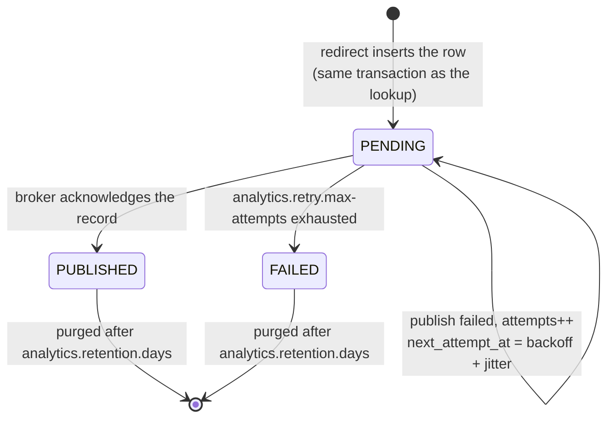

# Click analytics — configuration and resolved defaults

This document is the source of truth for the `analytics.*` configuration namespace introduced by
task T1 (build, dependency and configuration foundation). The values are bound and validated by
`com.example.shortener.analytics.config.AnalyticsProperties`; `application.yml` repeats them and
`AnalyticsPropertiesTest` fails if the two drift apart.

## The pipeline in one picture

```mermaid
flowchart LR
    RED["redirect<br/><i>request thread</i>"] --> OB["click_outbox<br/>PENDING"]
    OB --> REL["OutboxPoller<br/><i>every analytics.outbox.poll-interval-ms,<br/>&le; batch-size rows, SKIP LOCKED</i>"]
    REL --> K(["url.clicked"])
    K --> CON["ClickEventConsumer<br/><i>dedupe + upsert, one transaction</i>"]
    CON --> AGG[("click_stats<br/>click_stats_daily")]
    AGG --> STATS["GET /api/v1/urls/&#123;code&#125;/stats"]
    classDef store stroke:#6b7280,stroke-width:2px
    class AGG,K store
```

A `click_outbox` row moves through exactly these states — nothing on the request thread waits for any of it:

Aggregates (`click_stats`, `click_stats_daily`) are never purged: they outlive the raw rows they were built from.

## Build foundation

| Concern | Decision |
|---|---|
| Kafka client | `spring-boot-starter-kafka` (Boot-managed `spring-kafka`). Producers connect on first send only; nothing opens a broker connection at start-up. |
| Retry / backoff | Spring Framework 7's built-in `org.springframework.core.retry` (`RetryTemplate`, `RetryPolicy` with exponential backoff and jitter). No extra resilience library, no new infrastructure. |
| Test support | `spring-kafka-test` (embedded broker for unit-level tests) and `testcontainers-kafka` (real broker for `*IT.java`, alongside the existing PostgreSQL and Redis containers). |
| OpenAPI | Unchanged `it` profile: `./mvnw -q -Pit verify` starts the app, runs failsafe and dumps `target/openapi.json` + `target/openapi.yaml` through `springdoc-openapi-maven-plugin`. The committed contract stays at `src/main/resources/openapi.yaml`. |
| Broker address | `spring.kafka.bootstrap-servers`, read from `SHORTENER_KAFKA_BOOTSTRAP_SERVERS` (default `localhost:9092`). |

## Resolved ambiguities

| Id | Question | Resolution (default) | Property |
|---|---|---|---|
| AMB-12 | How is the client IP protected? | Store only a salted hash. The salt is a secret injected through the environment (`SHORTENER_ANALYTICS_IP_SALT`), never committed. It must be at least 16 characters; the checked-in fallback `local-dev-only-not-a-secret` exists only so local runs and tests boot. | `analytics.salt` |
| AMB-16 | How does the outbox relay pace itself? | Poll every **500 ms**, relay at most **100** events per pass. Bounds: 50 ms – 60 s, 1 – 10 000 events. | `analytics.outbox.poll-interval-ms`, `analytics.outbox.batch-size` |
| AMB-17 | What happens when Kafka is slow or down? | A produce request times out after **5 s**. Publishing is retried **5** times with exponential backoff starting at **100 ms**, capped at **10 s**, with **full** jitter (`sleep = random(0, min(cap, base * 2^attempt))`; `equal` and `none` are also accepted). The cap must be ≥ the base. | `analytics.kafka.timeout-ms`, `analytics.retry.max-attempts`, `analytics.retry.base-backoff-ms`, `analytics.retry.max-backoff-ms`, `analytics.retry.jitter` |
| AMB-18 | How long are raw click events kept? | **90 days**; older rows are purged by the retention job. Bounds: 1 – 3650 days. | `analytics.retention.days` |

## Data model (task T2, `V2__click_analytics.sql`)

Additive, forward-only Flyway migration; nothing from V1 (`urls`, `url_code_seq`) is altered. All
timestamps are `timestamptz` written in UTC; `click_stats_daily.day` is the UTC calendar day of the
click. **No table stores a client address or any other personal data**: the only address-derived
column is `hashed_ip`, a salted SHA-256 digest as 64 lowercase hex characters, enforced by
`click_outbox_hashed_ip_chk`.

| Table | Purpose | Key / constraints | Indexes |
|---|---|---|---|
| `click_outbox` | Transactional outbox of click events recorded on the redirect path and relayed to Kafka | `id` identity PK; `idempotency_key` UNIQUE; `status IN ('PENDING','PUBLISHED','FAILED')`; `attempts >= 0` | `(status, next_attempt_at)` for the relay claim, `(occurred_at)` for the retention purge |
| `click_stats` | Lifetime clicks per short code (`total_clicks`, `last_clicked_at`, `updated_at`) | PK `short_code`; `total_clicks >= 0` | – |
| `click_stats_daily` | Clicks per short code per UTC day (`count`) | PK `(short_code, day)`; `count >= 0` | – |
| `processed_click_event` | Consumer-side dedupe marker (`processed_at`) | PK `idempotency_key` | – |

Java mapping (`com.example.shortener.analytics`), validated against the schema at start-up by
`spring.jpa.hibernate.ddl-auto: validate`:

| Class | Notes |
|---|---|
| `domain.ClickOutboxEntry`, `domain.OutboxStatus` | Entity + status enum (stored by name through an `AttributeConverter`). State transitions: `markPublished`, `scheduleRetry`, `markFailed`; all increment `attempts`. |
| `domain.ClickStats`, `domain.ClickStatsDaily` (with embedded `Key`) | Aggregate entities read by the stats endpoint. |
| `domain.ProcessedClickEvent` | Dedupe marker entity. |
| `repository.ClickOutboxRepository` | `claimBatch(now, limit)`: native `SELECT … WHERE status = 'PENDING' AND next_attempt_at <= :now ORDER BY next_attempt_at, id LIMIT :limit FOR UPDATE SKIP LOCKED`. Must be called inside the relay's transaction; concurrent relays never claim the same row and never block each other. `deleteOccurredBefore(cutoff)` backs the retention job. |
| `repository.ClickStatsRepository` | Atomic `INSERT … ON CONFLICT DO UPDATE` upserts `incrementTotal` (moves `last_clicked_at` forward only) and `incrementDaily`; `findDaily(shortCode, from, to)`. |
| `repository.ProcessedClickEventRepository` | `insertIfAbsent(key, at)` returns `1` when newly recorded and `0` on a replay (`ON CONFLICT DO NOTHING`); `deleteProcessedBefore(cutoff)`. |

Tests: `ClickAnalyticsMigrationTest` (Docker-free, `./mvnw test`) pins the SQL shape, the absence
of personal-data columns and the entity/column match; `ClickAnalyticsRepositoryIT`
(`./mvnw -Pit verify`, Testcontainers PostgreSQL) proves the migration applies, the unique key is
enforced, `claimBatch` returns at most `batchSize` rows and skips rows locked by a concurrent
transaction, and the upserts/dedupe behave as described.

## Retention job (task T6, AC-12)

`com.example.shortener.analytics.retention.ClickRetentionJob` is an in-process scheduled job
that purges **raw** click rows older than `analytics.retention.days` (AMB-18, default 90 days).
It deletes `click_outbox` rows with `occurred_at < now - retention` (whatever their relay
status) and `processed_click_event` dedupe markers with `processed_at < now - retention`. The
aggregates `click_stats` and `click_stats_daily` are **never touched**: they are the product of
the events and keep the full history of a link after its raw events are gone.

| Property | Default | Meaning |
|---|---|---|
| `analytics.retention.days` | `90` | Age (in days, 1 – 3650) after which raw rows are purged. |
| `analytics.retention.cron` | `0 0 3 * * *` (03:00 UTC daily) | Spring 6-field cron expression for the run cadence; evaluated in UTC. |
| `analytics.retention.batch-size` | `1000` | Maximum rows deleted per statement. Each batch runs in its own transaction. |
| `analytics.retention.max-batches-per-run` | `100` | Maximum batches per table per run; whatever remains is picked up by the next run. |

How a run works:

1. The cutoff is computed once as `now - analytics.retention.days`.
2. `click_outbox` is purged oldest-first with
   `DELETE FROM click_outbox WHERE id IN (SELECT id … WHERE occurred_at < :cutoff ORDER BY occurred_at, id LIMIT :batch)`,
   one batch per transaction, until a batch comes back short or `max-batches-per-run` is reached.
   The `(occurred_at)` index created by V2 serves this scan.
3. `processed_click_event` is purged the same way on `processed_at`.
4. One `INFO` line is logged per run with the cutoff, the retention days and the deleted counts
   per table. No column value of any deleted row (short code, hashed address, referrer, key) is
   ever logged. A failing run is logged at `ERROR` with its partial counts and swallowed; the
   schedule survives and the next tick retries.

The job runs on the single-threaded `analyticsTaskScheduler` shared with the outbox relay, so it
never runs on a request thread and never concurrently with a relay pass. The `@Scheduled`
placement in `..analytics.retention` is one of the two locations allowed by the architecture
rules. Bounds are enforced at start-up: a non-positive `batch-size` or `max-batches-per-run`
fails bean creation.

Tests: `ClickRetentionJobTest` (Docker-free, `./mvnw test`) pins the cutoff arithmetic, one
bounded `DELETE` per batch in its own transaction, the stop conditions, that only the two raw
tables are named, the cron/scheduler placement and counts-only logging;
`ClickRetentionJobIT` (`./mvnw -Pit verify`, Testcontainers PostgreSQL) inserts rows straddling
the 90-day boundary in both raw tables plus populated aggregates and asserts that only the older
raw rows are deleted, that the aggregates are byte-for-byte unchanged, and that a run deletes at
most `batch-size × max-batches-per-run` rows before the next run finishes the job.

## Environment variables

| Variable | Property | Default |
|---|---|---|
| `SHORTENER_ANALYTICS_IP_SALT` | `analytics.salt` | non-secret local marker (set in production) |
| `SHORTENER_KAFKA_BOOTSTRAP_SERVERS` | `spring.kafka.bootstrap-servers` | `localhost:9092` |

All other `analytics.*` values can be overridden with the standard Spring relaxed binding, e.g.
`ANALYTICS_RETENTION_DAYS=30` or `--analytics.retry.max-attempts=3`. Out-of-bounds values abort
start-up with a binding error.

## Stats endpoint (task T7, AC-8, AC-9, AC-14, AC-15)

`GET /api/v1/urls/{short_code}/stats` (operationId `getUrlClickStats`, package
`com.example.shortener.analytics.api`) exposes the aggregates maintained by the consumer. It is
purely additive: no existing operation, field or status code changed, and the committed
`src/main/resources/openapi.yaml` gained the operation, the `analytics` tag and the
`ClickStatsResponse` / `ClickStatsDayEntry` schemas (parity is pinned by `OpenApiContractIT`).
Like the write surface it is gated on `@Profile("!read")`, so a read-only redirect instance
answers 404 to the route.

| Class | Role |
|---|---|
| `api.ClickStatsController` | Thin `@RestController`; springdoc metadata; no error bodies. |
| `api.ClickStatsQueryService` | Read model: existence check on `urls`, `click_stats` by key, `click_stats_daily` over the window; one read-only transaction. |
| `api.ClickStatsResponse`, `api.ClickStatsDayEntry` | Immutable response records with snake_case JSON names. |

| Field | Source | Never-clicked link |
|---|---|---|
| `total_clicks` | `click_stats.total_clicks` | `0` |
| `last_clicked_at` | `click_stats.last_clicked_at` | `null` |
| `as_of` | `click_stats.updated_at`; the service clock's "now" when no aggregate row exists | now |
| `clicks_by_day` | `click_stats_daily` rows for the inclusive UTC window `[today - 29, today]`, ascending by `date`, rows with `count = 0` dropped (sparse list) | `[]` |

Status codes: `200` (also for zero clicks), `404 application/problem+json`
(`short-code-not-found`, through the existing `GlobalExceptionHandler`) when no link has the short
code, `500` for unexpected failures. **Authentication:** the code base has no `/api/v1`
authentication scheme (no security dependency; authentication is a stated non-goal of the design),
so the endpoint carries no `401` response. Adding one would introduce a new dependency and needs an
ADR plus human approval.

Freshness: the aggregates are written asynchronously by the outbox relay and the Kafka consumer, so
the numbers can lag behind the redirects by that pipeline's latency; clients read `as_of` to know
how fresh they are.

Tests: `ClickStatsControllerTest` (standalone MockMvc over the real service, mocked repositories,
fixed clock: 200 with data, 200 empty, 404, 500, the 30-day UTC window boundary and profile gating)
and `ClickStatsQueryServiceTest` (window arithmetic, zero-count filtering, DTO invariants).

## Integration tests, latency gate and release artifacts (task T8, AC-13, AC-14, AC-15)

Package `com.example.shortener.analytics.it`, run only by failsafe under `./mvnw -q -Pit verify`
(Docker required). All three extend `com.example.shortener.it.AbstractIntegrationTest`
(Testcontainers PostgreSQL 17 + Redis 7, application on a random port).

| Class | Context | Proves |
|---|---|---|
| `ClickAnalyticsEndToEndIT` | own context: + Testcontainers Kafka (`apache/kafka:3.8.0`, topic `url.clicked` pre-created), relay every 100 ms, consumer from `earliest` | redirect `302` + `Location` -> exactly one `click_outbox` row -> `PUBLISHED` by the relay -> `processed_click_event` + `click_stats` by the consumer -> stats endpoint reports the click with one `clicks_by_day` entry for today (UTC). Re-sending the identical record (same `idempotency-key`) is counted as a duplicate and changes nothing. Unknown codes: `404`, no row, no event; never-clicked links: `0` / `null` / `[]`. |
| `KafkaUnavailableRedirectIT` | own context: `spring.kafka.bootstrap-servers=127.0.0.1:1` (nothing listens), `max.block.ms=500`, listener off, relay tick at its 60 s maximum | with no broker the redirect keeps `302` + `Location`, answers in well under the producer's blocking bound (nothing touches Kafka on the request thread) and the click stays `PENDING` with `attempts = 0` and no `published_at`. Unknown codes still produce no row. |
| `RedirectLatencyBudgetIT` | shared base context (no broker, relay running on its own thread) | p95 of `GET /{short_code}` (warm-up, then timed samples, nearest-rank percentile) is at most the recorded baseline + `tolerance-percent` (5 %). |

Latency baseline: `src/test/resources/analytics/redirect-latency-baseline.properties`
(`p95-ms`, `tolerance-percent`, `warmup-requests`, `sample-requests`). Override with
`-Dredirect.latency.baseline-p95-ms=<ms>`; re-record with `-Dredirect.latency.record=true`, which
writes `target/redirect-latency-baseline.properties` (the test then passes) so the new value can
be reviewed and copied into the resource. The gate measures the full production path including
the outbox insert, so it bounds the cost the analytics feature adds to a redirect.

Release artifacts: the `Dockerfile` (two-stage, Maven wrapper build, non-root JRE runtime) only
documents the analytics variables (`SHORTENER_KAFKA_BOOTSTRAP_SERVERS`,
`SHORTENER_ANALYTICS_IP_SALT`); nothing secret is baked in. `.github/workflows/ci.yml` runs
compile, spotless (advisory), `ArchitectureTest`, `./mvnw -q test` and `./mvnw -q -Pit verify`
(which includes the three tests above and the OpenAPI dump to `target/openapi.yaml`, compared with
`src/main/resources/openapi.yaml` by `OpenApiContractIT`). The README documents the pipeline, the
configuration table, the privacy/retention guarantees and the stats endpoint.
